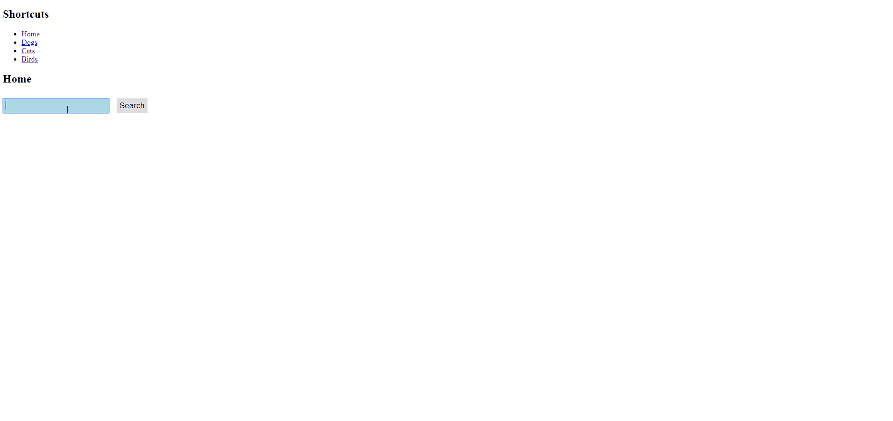

# My React FlickR Gallery

This is a simple app that let you search pictures samples (limited to 20 images per search) from FlickR.

Well..the app is ugly but at least it works 0:).

Used technologies:
- [ReactJS](https://fr.reactjs.org/)
- [React Router](https://github.com/ReactTraining/react-router)
- [Flickr SDK](https://github.com/flickr/flickr-sdk) for Javascript

## Preview



## Setup the app

You can either bootstrap this application locally if you have a NodeJS setup already installed, anyway I strongly advise you to follow the steps below.

### Prerequesites

- Docker CE (at least 17.04.0+) & Docker-compose
- An API KEY to FLICKR's REST API

## Build the container
With Docker only:
```bash
$>docker build -t myreactgallery .
... lot of magical build blabla
Successfully built 5089a0ee32579
Successfully tagged myreactgallery:latest
$>
```
With Docker Compose:
```bash
$>docker-compose build
... lot of magical build blabla
Successfully built 5005a7ee2254
Successfully tagged myreactgallery_app:latest
$>
```

## Start the App
With Docker only:
```bash
$>docker run -it -p 3001:3000 -e REACT_APP_FLICKR_API_KEY=<YOU FLICKR API KEY> myreactgallery
```
The above command will bind your local 3001 port to the container's 3000 port where the app is listening.
With Docker Compose, you must edit first the ```docker-compose.yml``` file at the root folder by modifiying the placeholder by your FLICKR API KEY.
```yaml
version: '3.2'

services:
  app:
    container_name: myreactgallery
    build:
      context: .
      dockerfile: Dockerfile
    ports:
      - '3001:3000'
    environment:
      - REACT_APP_FLICKR_API_KEY=placeholder <= EDIT HERE!
```
Then...
```bash
$>docker-compose up
Recreating myreactgallery ... done
Attaching to myreactgallery
myreactgallery | yarn run v1.21.1
myreactgallery | $ react-scripts start
myreactgallery | ℹ ｢wds｣: Project is running at http://172.18.0.2/
myreactgallery | ℹ ｢wds｣: webpack output is served from /
myreactgallery | ℹ ｢wds｣: Content not from webpack is served from /opt/public
myreactgallery | ℹ ｢wds｣: 404s will fallback to /index.html
myreactgallery | Starting the development server...
myreactgallery |
myreactgallery | Compiled successfully!
myreactgallery |
myreactgallery | You can now view myreactgallery in the browser.
myreactgallery |
myreactgallery |   Local:            http://localhost:3000/
myreactgallery |   On Your Network:  http://172.18.0.2:3000/
myreactgallery |
myreactgallery | Note that the development build is not optimized.
myreactgallery | To create a production build, use yarn build.
myreactgallery |
TADAAA!!
```

## Play with it!

Now open your favorite browser and access this address: ```http://localhost:3001```.
